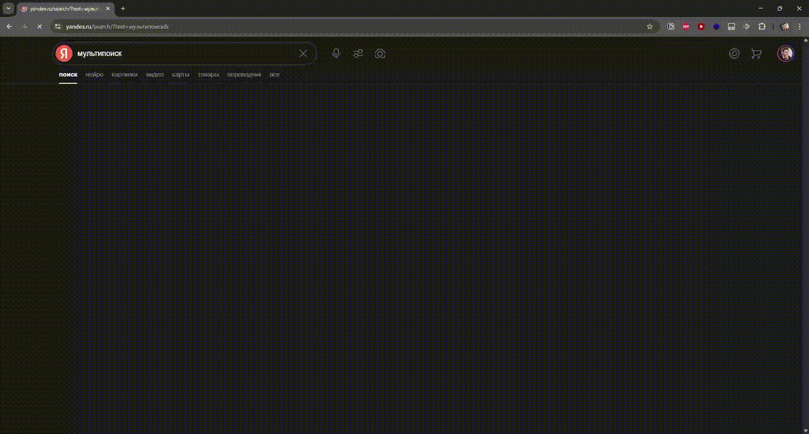

# Несколько скриптов для регулярного решения специфичных задач.

> Для работы нужно расширение [Tampermonkey®](https://www.tampermonkey.net/)

## Оглавление

- [Несколько скриптов для регулярного решения специфичных задач.](#несколько-скриптов-для-регулярного-решения-специфичных-задач)
  - [Оглавление](#оглавление)
- [Мультипоиск](#мультипоиск)
    - [Установка](#установка)
    - [Настройка сервисов](#настройка-сервисов)
- [Ozon и Wildberies – экспорт карточки товара в txt](#ozon-и-wildberies--экспорт-карточки-товара-в-txt)
- [Яндекс.Музыка](#яндексмузыка)
  - [Удаление бесполезной анимации](#удаление-бесполезной-анимации)
  - [Имена треков открытого плейлиста в файл](#имена-треков-открытого-плейлиста-в-файл)
    - [Список имён в плейлист `.m3u`](#список-имён-в-плейлист-m3u)
- [Яндекс.Карты](#яндекскарты)
  - [Список точек в KML](#список-точек-в-kml)
- [YouTube](#youtube)
  - [Утилитки для YouTube](#утилитки-для-youtube)

# [Мультипоиск](https://github.com/nikmedoed/myTampermonkeyScripts/raw/main/multisearch.user.js)

Гибкая панель для повторного поиска на других сайтах.

Скрипт добавляет на указанные страницы боковую панель с кнопками, которые позволяют одним кликом повторить текущий поисковый запрос на других сервисах (например, перейти от OZON → WB → AliExpress).
Скрипт автоматически определяет домен и извлекает запрос из URL или поля поиска, а список сервисов можно расширить через встроенные настройки.

### Установка

1. Установите расширение [Tampermonkey®](https://www.tampermonkey.net/).
2. Перейдите по [ссылке](https://github.com/nikmedoed/myTampermonkeyScripts/raw/main/multisearch.user.js) и установите скрипт

### Настройка сервисов

1. Нажмите на иконку Tampermonkey → **Мультипоиск – Настройки**.
2. В открывшемся окне добавьте или отредактируйте строки:

   - **Name** — подпись кнопки.
   - **URL** — часть адреса до параметра запроса (напр., `https://site.com/search?q=`).
   - **Hosts** — домены, где будет отображаться панель.
   - **SearchPath** — RegExp для пути страницы поиска.
   - **QueryParam** — имя GET‑параметра (если не указано, берётся автоматически).
   - **SearchInput** — CSS‑селектор поля ввода (если параметр не указан).
   - **Icon** — домен или URL favicon (используется Google S2).

3. Нажмите **Сохранить** и перезагрузите страницу для применения изменений.

# [Ozon и Wildberies – экспорт карточки товара в txt](https://github.com/nikmedoed/myTampermonkeyScripts/raw/main/Product-card-extract-OZON-WB.user.js)

В эпоху нейросетей я стал всё чаще доверять финальный отбор товаров именно им. Первичный отсев на фейковые и неадекватные позиции я провожу вручную, пролистывая сотни карточек, а затем **быстро экспортирую выбранные 10–30 товаров** в текст, чтобы передать GPT.

Скрипт добавляет кнопку **«Скачать»** на страницах товаров **Ozon** и **Wildberries**. После нажатия:

* собираются название, бренд, цена, оригинальность;
* описание и характеристики;
* до **100 отзывов с оценками**;
* итог сохраняется в `.txt` файл и **копируется в буфер обмена**.

Я передаю это GPT, и та выкидывает мусорные позиции — остаётся 2–5 кандидатов для вдумчивого ручного анализа. Это **радикально сокращает время выбора**.

А чтобы быстро объединить много текстовых файлов в одно сообщение я использую и рекомендую [мою утилитку для копирования группы файлов (целыми папками) в буфер с информацией о структуре](https://github.com/nikmedoed/toGPT).

# Яндекс.Музыка

## [Удаление бесполезной анимации](https://github.com/nikmedoed/myTampermonkeyScripts/raw/main/YandexMusic-rup-animation-remover.user.js)

Если вы тоже не понимаете зачем вам раздражающая анимация, которая обеспечивает стабильную загрузку до нескольких процентов ЦП, то вот решение.

Скрипт просто удалит это анимацию, когда вы зайдёте на страницу с ней.

## [Имена треков открытого плейлиста в файл](https://github.com/nikmedoed/myTampermonkeyScripts/raw/main/YandexMusic-collectTrackNames.user.js)

Каюсь, я скачиваю подскасты и слушаю в своём плеере. Меня очень напрягает как яндекс управляет порядком проигрывания в подкастах, а также косячная сихнронизация между устройствами, которая приносит только негатив. В приложении слушаю музыку, а подкасты в своём плеере с ускорением 2.5-3х.

После загрузки возникает проблема, т.к. записи нужно выстроить в нужном порядке. Поэтому я сохраняю все имена треков в файл, а потом python скриптом собираю плейлист.

### Список имён в плейлист `.m3u`

Полученный файл со списком имён нужно поместить в одну директорию с файлами аудиозаписей. Запустить [python скрипт](https://github.com/nikmedoed/myTampermonkeyScripts/raw/main/create_playlist.py), указав путь до этой директории. Скрипт сгенерирует в этой директории `.m3u` файл плейлиста с относительными путями.

# Яндекс.Карты

## [Список точек в KML](https://github.com/nikmedoed/myTampermonkeyScripts/raw/main/Yandex.map-bookmarks-to-KML.user.js)

Для путешествий и приключений я привык собирать точки в Яндекс картах. Однако, не везде они способны построить маршрут, а перепад высот, как в Organic Maps, они вообще не учитывают. Но конечно, как и любой другой user-friendly сервис, Яндекс не стремится делиться с вами вашими данными.

Этот скрипт сохранит все закладки из списка точек в KML файл, который понимают чуть ли не все открытые картографические сервисы. Во всяком случае, Organic Maps их легко считывает.

# YouTube

## [Утилитки для YouTube](https://github.com/nikmedoed/myTampermonkeyScripts/raw/main/YouTube-Toolkit.user.js)

Я уже несколько лет не могу выделить время закончить своё расширение для управления списком просмотра на YouTube, что накопилось несколько скриптов, которые решают частные задачи, не решаемые моей текущей dev версией. Вот штуки, которые умеет этот скрипт:

- Добавить все видимые видео в плейлист текущего просмотра
- Добавить все видимые видео в плейлист текущего просмотра в обратном порядке
- Посчитать длительность активного плейлиста в часах
- Удалить из плейлиста N видео с начала

В целом так уже можно управлять своим просмотром. Можно зайти на канал в раздел видео и добавить все записи. Или из своего огромного списка "смотреть позже" удалить уже просмотренные, чтобы они не загружали интерфейс.